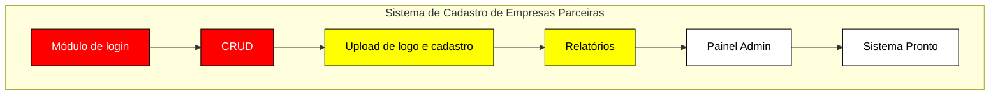

```mermaid

graph TD
subgraph Sistema de Cadastro de Empresas Parceiras

A1["Módulo de login"]:::vermelho--> A2["CRUD"]:::vermelho--> A3["Upload de logo e cadastro"]:::amarelo -->
A4["Relatórios"]:::amarelo--> A5["Painel Admin"]:::branco--> A6["Sistema Pronto"]:::branco


end

classDef branco fill:#fff, stroke:#000, stroke-width:1px, color:#000;
classDef amarelo fill:#ffff00, stroke:#000, stroke-width:1px, color:#000;
classDef vermelho fill:#ff0000, stroke:#000, stroke-width:1px, color:#fff;

```
