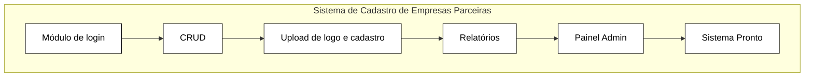

```mermaid

graph TD
subgraph Sistema de Cadastro de Empresas Parceiras

A1["Módulo de login"]:::branco--> A2["CRUD"]:::branco--> A3["Upload de logo e cadastro"]:::branco -->
A4["Relatórios"]:::branco--> A5["Painel Admin"]:::branco--> A6["Sistema Pronto"]:::branco


end

classDef branco fill:#fff, stroke:#000, stroke-width:1px, color:#000;

```
