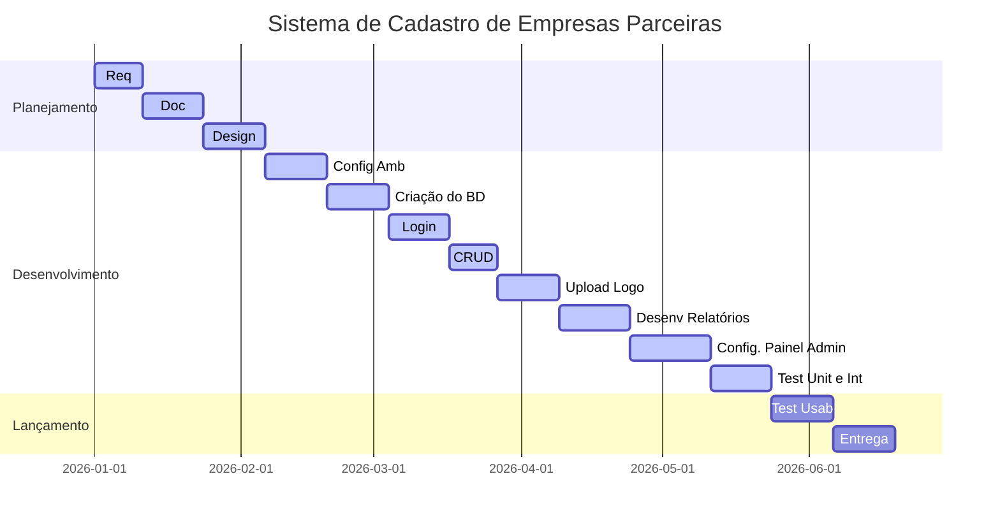

```mermaid
  gantt

  title Sistema de Cadastro de Empresas Parceiras
  dateFormat YYYY-MM-DD

  section Planejamento
  Req :active, req, 2026-01-1, 10d
  Doc :active, doc, after req, 13d
  Design :active, des, after doc, 13d

  section Desenvolvimento
  Config Amb :active, dev, after des, 13d
  Criação do BD :active, db, after dev, 13d
  Login :active, login, after db, 13d
  CRUD :active, crud, after login, 10d
  Upload Logo :active, logo, after crud, 13d
  Desenv Relatórios :active, devrelat, after logo, 15d
  Config. Painel Admin :active, configpain, after devrelat, 17d
  Test Unit e Int : active, unit, after configpain, 13d

  section Lançamento
  Test Usab: usab, after unit, 13d
  Entrega: entreg, after usab, 13d
  
```
